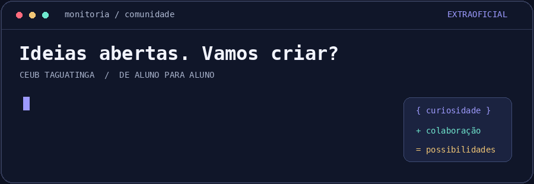

<div align="center">
<H1>GITHUB MONITORES TI CEUB TAGUATINGA</H1>
  


<strong>💻 Monitoria de TI · CEUB Taguatinga. Uma dúvida, uma ideia e um projeto de cada vez.

🧠 Aprender · 🛠️ Experimentar · 🤝 Colaborar · 🚀 Idealizar</strong>
</div>

----

## 👋 Olá, Bem-vindos(as).

Somos monitores de TI do CEUB de Taguatinga, e este é o nosso cantinho para aproximar quem quer aprender, compartilhar conhecimento e tirar ideias do papel.

Sabe aquela dúvida que ficou depois da aula? A ideia de projeto que apareceu no intervalo? A vontade de aprender uma tecnologia, mas sem saber por onde começar? Ou aquele código que funcionava até você mudar só uma coisinha? 🫠

Tudo isso tem espaço por aqui.

Você pode explorar os materiais, sugerir assuntos, pedir ajuda, compartilhar descobertas e encontrar gente para construir alguma coisa junto. Seja no primeiro Olá, mundo! ou no projeto que já tem mais pastas do que você gostaria.

🧭 Este é um espaço extraoficial, organizado por monitores. Não é um canal institucional do CEUB e não substitui os canais oficiais, as orientações dos professores ou os procedimentos acadêmicos. A proposta aqui é manter a troca entre alunos próxima, leve e sem burocracia desnecessária.

### 💡 Qual é a ideia?

Criar um lugar onde a vontade de aprender encontre companhia.

Queremos reunir conhecimentos que às vezes ficam espalhados em conversas, anotações e projetos pessoais — e abrir espaço para o que vocês gostariam de estudar, testar ou desenvolver.
- 📚 Compartilhar o que ajuda: explicações, exemplos, referências, dicas e materiais de estudo.
- 🧩 Destravar dúvidas: conversar sobre o raciocínio, investigar erros e pensar em caminhos possíveis.
- 🌱 Dar espaço a ideias: uma proposta ainda pode estar no “e se a gente fizesse…?”.
- 🛠️ Aprender fazendo: experimentar ferramentas, montar projetos e descobrir coisas na prática.
- 🤝 Aproximar pessoas: conectar quem quer aprender com quem pode contribuir.
- 🔄 Fazer o conhecimento circular: o que alguém aprendeu hoje pode ajudar outra pessoa amanhã.

Você não precisa chegar sabendo. Curiosidade já é um ótimo começo.

### 🧰 O que cabe aqui?

TI é grande demais para caber em uma única linguagem. Estes são alguns dos assuntos que podem aparecer conforme as dúvidas, os interesses e as contribuições da comunidade:

Área	Ideias para explorar

🧠 Lógica e programação	Primeiros passos, algoritmos, estruturas de dados e resolução de problemas.

🌐 Desenvolvimento web	Interfaces, backend, APIs e aplicações completas.

📱 Aplicativos	Desenvolvimento mobile, interfaces e integração com serviços.

🗃️ Banco de dados	Modelagem, SQL, consultas e organização dos dados.

🎮 Jogos	Mecânicas, engines, protótipos e experiências interativas.

🤖 IA e automação	Experimentos, ferramentas e aplicações práticas, com atenção aos seus limites.

🐧 Sistemas e redes	Terminal, Linux, comunicação entre sistemas e fundamentos de infraestrutura.

🔐 Segurança	Proteção de dados, boas práticas e estudos em ambientes autorizados.

🧑‍💻 Git e GitHub	Versionamento, repositórios e colaboração em projetos.

🚀 Projetos e desafios	Ideias próprias, estudos em grupo, desafios de programação e construção de portfólio.


Não encontrou o que queria? Sugere! Essa lista é um ponto de partida, e o espaço pode crescer junto com os interesses de quem participa.
🌱 Estamos construindo este ambiente aos poucos. Os temas acima são possibilidades; os materiais e projetos disponíveis são os que já estiverem publicados nos repositórios.

🗺️ Como funciona este espaço?

Pense neste perfil como o ponto de encontro. Os repositórios são os lugares onde ficam os materiais e projetos, cada um com sua proposta.
1. Explore o que já existe. Dê uma olhada nos repositórios e nos destaques do perfil.
2. Abra o que despertou sua curiosidade. O README de cada projeto explica do que ele trata e como começar.
3. Entre na conversa. Traga uma dúvida, uma sugestão, uma melhoria ou uma ideia nova.
4. Participe no seu ritmo. Vale estudar um exemplo, corrigir uma explicação ou se envolver em um projeto maior.

Nem todo repositório precisa virar um sistema completo. Um exemplo pequeno que esclarece um conceito também tem muito valor. ✨

### 🤔 como participar?

Tem várias formas de somar por aqui:
- Estou começando: explore os materiais e pergunte quando algo não fizer sentido.
- Encontrei algo legal: compartilhe uma ferramenta, referência ou descoberta e conte por que ela ajudou.
- Vi algo que pode melhorar: avise sobre um erro ou sugira uma explicação mais clara.
- Quero contribuir: ajude com código, documentação, exemplos, testes, organização ou ideias.
- Tenho uma proposta: conte o que gostaria de criar ou estudar. Não precisa trazer um plano pronto.
- Procuro companhia para um projeto: apresente a ideia e diga em que gostaria de ter ajuda.

Contribuição não se resume a código. Uma boa pergunta, uma explicação acessível ou um teste que encontra um problema também fazem diferença.

### 💬 Onde conversar?

O principal ambiente de conversa será o grupo do WhatsApp ou o grupo do Discord. 

Para dúvidas e sugestões sobre um conteúdo (repositório), use a aba Issues do repositório correspondente, quando estiver disponível. Se o projeto tiver Discussions, ela também pode ser usada para trocar ideias.

Para propostas gerais ou quando não souber onde postar, procure um dos monitores. A gente ajuda a encontrar o caminho, inclusive se você ainda estiver aprendendo a usar o GitHub. 😊
<!-- OPCIONAL: acrescente aqui os contatos reais da monitoria: perfis dos monitores, e-mail, grupo ou comunidade. Publique apenas contatos autorizados. -->

Mensagens em Issues e Discussions de repositórios públicos ficam visíveis para outras pessoas. Para assuntos pessoais, procure um monitor por um canal privado.

### 🆘 Travou em alguma coisa?

Pode perguntar. Ninguém precisa saber tudo para participar.

Para facilitar a ajuda, tente contar o que você queria fazer, o que aconteceu e o que já tentou. Se tiver uma mensagem de erro ou um trecho pequeno do código, melhor ainda.

Não precisa preencher formulário. Se ajudar, use este roteiro:
- Estou tentando:
- O que aconteceu:
- O que eu já tentei:
- Trecho do código ou mensagem de erro:

“Meu código não funciona” é um começo. “Queria ordenar a lista, mas recebi este erro ao executar” já dá uma pista muito melhor. 🔎

Quando possível, mande o código como texto, formatado com três crases (```), para facilitar a leitura e os testes. E confira se não deixou senhas, tokens ou dados pessoais no trecho compartilhado.

A proposta é ajudar você a entender o caminho, pensar na solução e ganhar autonomia. Podemos discutir exercícios e raciocínio, respeitando as orientações da atividade e a autoria de quem está aprendendo.

Também temos aulas, estudos e outras atividades, então as respostas dependem da disponibilidade dos monitores e de quem participa. Se você descobriu a solução antes, volta para contar: sua resposta pode salvar o próximo colega. 🙏

### 🚀 Tem uma ideia? Joga na roda!

Pode ser uma proposta de projeto, um assunto para estudar em grupo, uma sugestão de material ou uma atividade que você gostaria de ver acontecer.

Por exemplo:

💭 “Queria aprender Git na prática. Bora fazer um projeto pequeno juntos?”

💭 “Tenho uma ideia de aplicativo e queria conversar sobre como começar.”

💭 “Podíamos reunir exemplos de SQL com explicações das consultas.”

💭 “Alguém anima criar um jogo ou treinar para uma maratona de programação?”

Conte a ideia do jeito que ela está. Se já souber, diga também o que gostaria de aprender e em que precisa de companhia.

As propostas podem ser discutidas e ganhar forma conforme o interesse e a disponibilidade do pessoal. Você não precisa chegar com apresentação, escopo fechado e vinte páginas de documentação para começar uma conversa. ☕

### 🛠️ Quero colocar a mão na massa

Encontrou um projeto e quer colaborar? Leia o README dele e veja o que já está acontecendo. Para uma mudança maior, vale conversar antes para juntar esforços e evitar trabalho duplicado.

<details>
<summary><strong>🌱 Nunca contribuí pelo GitHub. Por onde começo?</strong></summary>

Você pode começar abrindo uma Issue: é uma conversa registrada no repositório para relatar um problema, fazer uma pergunta ou sugerir algo.

Se quiser propor uma alteração nos arquivos, um caminho comum é:
1. Fazer um fork, criando uma cópia do repositório na sua conta.
2. Criar uma branch, um espaço separado para trabalhar na mudança.
3. Alterar os arquivos e registrar o que fez em um commit.
4. Abrir um pull request, apresentando a alteração para o projeto original.
5. Conversar sobre a proposta e ajustar o que for necessário antes de ela ser incorporada.

Parece muita palavra nova? Tudo bem. Dá para aprender uma etapa por vez, com ajuda. Uma correção no texto já pode ser sua primeira contribuição. 🎉
</details>

<details>
<summary><strong>🧪 O que ajuda na hora de enviar uma contribuição?</strong></summary>

- Explique brevemente o que mudou e por quê.
- Se alterou código, confira se ele funciona no cenário que você está propondo.
- Se criou um exemplo ou projeto, conte como executar e o que é necessário instalar.
- Dê crédito às referências e respeite as licenças dos materiais utilizados.
- Se alguma parte ainda não estiver pronta, avise. Projetos em construção também têm espaço aqui.

Não precisa estar perfeito para abrir a conversa. A ideia é que a gente consiga entender, testar e melhorar junto.
</details>

### 🤝 Nosso combinado

Queremos um ambiente leve, onde seja tranquilo perguntar, errar e aprender. Para isso, o básico importa:
- 💛 Respeite as pessoas. Sem humilhação por dúvidas, preconceito, assédio ou ataques pessoais.
- 🌱 Tenha paciência com quem está aprendendo. O que hoje parece simples já foi novidade para você também.
- 💬 Discorde com educação. Dá para discutir uma solução sem diminuir quem a propôs.
- 🧠 Compartilhe com honestidade. Dê os devidos créditos e não apresente trabalho alheio como seu.
- 🔐 Cuide dos dados e dos acessos. Não publique senhas, chaves, informações pessoais de terceiros ou conteúdo sem autorização.
- 🧹 Ajude a manter o espaço útil. Evite spam e dê um pouco de contexto ao que compartilhar.

O resto a gente conversa. Se algo atrapalhar a convivência, os monitores podem intervir para manter o espaço acolhedor.

### ❓ Perguntas que talvez já tenham passado pela sua cabeça
<details>
<summary><strong>Preciso ter experiência para participar?</strong></summary>

Não! Quem está começando também faz parte. Você pode aprender acompanhando os materiais, fazendo perguntas e participando de pequenas tarefas.
</details>

<details>
<summary><strong>Posso só acompanhar e estudar?</strong></summary>

Claro. Não existe obrigação de contribuir ou de manter uma frequência. Use o que fizer sentido para o seu momento e participe quando quiser.
</details>

<details>
<summary><strong>Posso trazer algo que não apareceu em aula?</strong></summary>

Pode! A ideia também é explorar interesses, ferramentas e projetos além dos conteúdos das disciplinas. Traga a proposta e vamos conversar.
</details>

<details>
<summary><strong>Minha ideia precisa estar pronta?</strong></summary>

Não. Um problema que você percebeu ou algo que gostaria de experimentar já pode render uma boa conversa. A comunidade pode ajudar a desenvolver a ideia.
</details>

<details>
<summary><strong>Qualquer pessoa pode alterar os projetos diretamente?</strong></summary>

Você pode propor mudanças pelos meios disponíveis em cada repositório. Alterações nos projetos são incorporadas por quem tem permissão, normalmente após uma conversa ou revisão. Isso ajuda a manter tudo funcionando sem impedir a colaboração.
</details>

<details>
<summary><strong>Os materiais publicados aqui são oficiais?</strong></summary>

Não. Este é um espaço extraoficial de colaboração entre alunos e monitores. Os conteúdos podem evoluir e receber correções. Para informações acadêmicas oficiais, use os canais institucionais.
</details>

<details>
<summary><strong>Encontrei um erro em um material. E agora?</strong></summary>

Avise! Se puder, indique onde está o problema e explique sua dúvida ou sugestão. Revisar e corrigir também faz parte de aprender junto.
</details>

_**☕ Puxa uma cadeira. Tem espaço para a sua ideia. Explore um repositório, traga uma dúvida ou comece uma conversa. Feito por monitores e construído com quem chega para somar.**_

<div align="center">
<strong>Monitoria de TI · CEUB Taguatinga · Brasília/DF</strong>

<em>Comunidade extraoficial de aprendizado e colaboração.</em>
</div>
